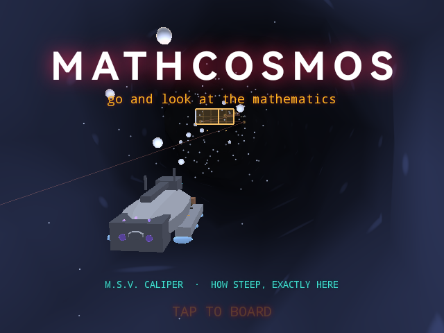
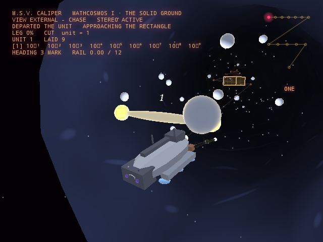

# MathCosmos

MathCosmos is a railed stereoscopic tour of mathematics for RayNeo X3 Pro AR glasses. Aboard the M.S.V. Caliper, a survey craft with a pair of measuring jaws, the wearer flies through six tours — algebra as carpentry, the approach to a derivative, accumulation and the Fundamental Theorem, infinite series, multivariable landscapes, and vector fields — a total of 76 stops and roughly three hours of narrated flight, guided by a three-person crew. Rather than illustrating equations with static diagrams, the app builds each idea as a physical scene the craft flies through: a quadratic literally is a square with a missing corner, a log scale is a ruler that re-spaces itself, a derivative is a pair of jaws that close until they cannot close further. The tours are written and paced as tutoring rather than narration, with built-in prediction pauses and retrieval questions between stops. It is the sister project of InnerCosmos, sharing the same rendering engine and crew, redirected from the human body into the abstractions of mathematics itself.

## Screenshots

  
  

## Controls

- Tap the right-arm touchpad to board and select a tour
- Tap during flight to switch camera view (Helm, Chase, The Core, The Measuring Deck)
- Swipe on the eye-line card to raise or lower where the material sits
- Double-tap to pause and reopen the stop menu
- Swipe forward to cycle the audio mix; swipe back to show or hide the telemetry HUD
- Turn your head to look around freely; the flight path itself is never steered
